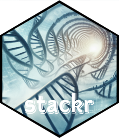

# stackr 

```{r, echo = FALSE}
description <- readLines("DESCRIPTION")
rvers <- stringr::str_match(grep("R \\(", description, value = TRUE), "[0-9]{1,4}\\.[0-9]{1,4}\\.[0-9]{1,4}")[1,1]
version <- gsub(" ", "", gsub("Version:", "", grep("Version:", description, value = TRUE)))
```

<!-- badges: start -->
[](https://tidyverse.org/lifecycle/#experimental)
[](http://cran.r-project.org/package=stackr)
[](http://www.repostatus.org/#active)
[](https://zenodo.org/badge/latestdoi/14548/thierrygosselin/stackr)
[](commits/master)
[)`-brightgreen.svg)](/commits/master)
[](https://cran.r-project.org/)
<!-- badges: end -->


```{r, echo = FALSE}
knitr::opts_chunk$set(
  collapse = TRUE,
  comment = "#>",
  fig.path = "README-"
)
```


# stackr: an R package to run stacks pipeline

This is the development page of **stackr**.

**stackr** package provides wrapper functions to run
[STACKS](http://catchenlab.life.illinois.edu/stacks/) (*process_radtags*,
*ustacks*, *cstacks*, *sstacks*, *tsv2bam*, *gstacks* and *populations*) inside R.

### **Who is it for ?**

* **stackr** is currently developed for my projects at CSIRO and to help colleagues and collaborators to get the most out of stacks. 
* I make **stackr** available for others, but I don't offer help, use it at your own risk.
* [STACKS](http://catchenlab.life.illinois.edu/stacks/) related issues should be highlighted 
in [stacks google group](https://groups.google.com/forum/?fromgroups#!forum/stacks-users).
* **It's not for R and/or stacks beginners**. Train with [STACKS](http://catchenlab.life.illinois.edu/stacks/) in the Terminal first.


### **Overview of the differences from running stacks**

* I work with thousands of samples, my [STACKS](http://catchenlab.life.illinois.edu/stacks/) experience is more **reproducible** and  **organized** inside RStudio
* **stackr** requires you to think ahead by using a project info file that outlines the sample names and it's metadata (think sampling sites, barcodes, sequencing lanes, etc).
* The outputs are organized by folders, it's more **tidy and it's automatic**. e.g. *logs* generated by [STACKS](http://catchenlab.life.illinois.edu/stacks/) 
are summarized in human-readable tables/tibbles, making **problem detection** easier.
* Most functions that runs [STACKS](http://catchenlab.life.illinois.edu/stacks/)
can be restarted if the computer/cluster/server crash. Just restart the same function. stackr takes care of the rest.

#### **Made it this far, here's more details:**

* *process_radtags* -> `run_process_radtags` (demultiplexing) : works better with multiple lanes and **technical replicates** inside or across chip/lanes are managed and accounted for.
* *ustacks* -> `run_ustacks` (*de novo* assembly): manages [STACKS](http://catchenlab.life.illinois.edu/stacks/) unique integer (*previously called SQL IDs*) and can also do **mismatch testing!** Integrated inside `run_ustacks` is a *de novo* mismatch threshold series function that generates tables and figures automatically to help you pick the appropriate thresholds.
* *cstacks* -> `run_cstacks` (catalog)
  * With more than 1000 samples, *cstacks* is problematic: time consuming and vulnerable to computer crashes and other interruptions. 
  * **stackr** generates catalogs incrementally, this way the pipeline is more rigorous if your computer/cluster/server crash, because the previous catalog will already be saved and available to start over.
  * Different catalogs with increasing sample number = better testing
 


## Installation
To try out the dev version of **stackr**, copy/paste the code below:

```r
if (!require("devtools")) install.packages("devtools")
devtools::install_github("thierrygosselin/stackr")
library(stackr)
```

## Stacks modules and RADseq typical workflow

**stackr** package provides wrapper functions to run
[STACKS](http://catchenlab.life.illinois.edu/stacks/) *process_radtags*,
*ustacks*, *cstacks*, *sstacks*, *tsv2bam*, *gstacks* and *populations* inside R.

Below, a flow chart
showing the corresponding stacks modules and stackr corresponding functions.


## Vignette

* [Get started section](http://thierrygosselin.github.io/stackr/articles/stackr.html)
* Web site with additional info: [stackr](http://thierrygosselin.github.io/stackr/)
* [Computer setup and troubleshooting](https://thierrygosselin.github.io/radiator/articles/rad_genomics_computer_setup.html)
* [Vignettes](https://thierrygosselin.github.io/radiator/articles/index.html)

## Citation:
To get the citation, inside R:
```r
citation("stackr")
```

## Life cycle

stackr is quite mature, i've used it for almost 8 years with dozens of projects,
but changes are inevitable.

* For reproducibility, if you use it, keep a copy safe.
* I follow [STACKS](http://catchenlab.life.illinois.edu/stacks/) development closely, 
when a new version comes out, stackr will likely change as well.
* Because of it's intrinsic nature, stackr will not be compatible with previous 
[STACKS](http://catchenlab.life.illinois.edu/stacks/) version.
* Philosophy, major changes and deprecated functions/arguments are documented in
life cycle section of functions. 
* The latest changes are documented in [changelog, versions, new features and bug history](http://thierrygosselin.github.io/stackr/news/index.html)
* [issues](https://github.com/thierrygosselin/stackr/issues/new/choose) and [contributions](https://github.com/thierrygosselin/stackr/issues/new/choose)

