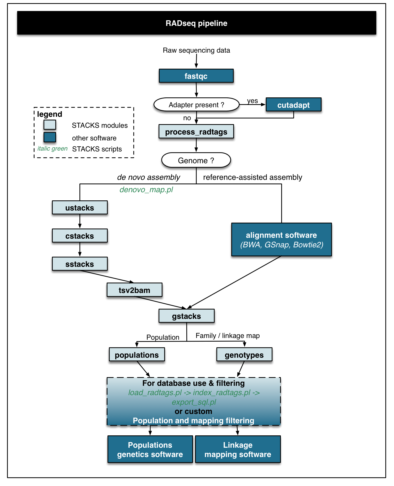
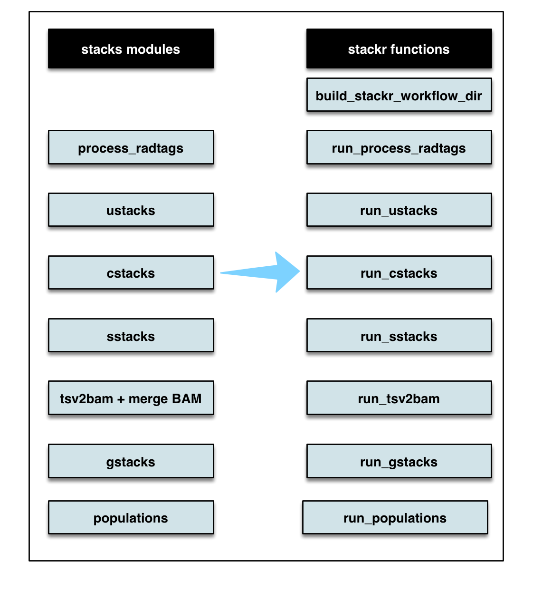

[](https://travis-ci.org/thierrygosselin/stackr) [](https://ci.appveyor.com/project/thierrygosselin/stackr) [](http://cran.r-project.org/package=stackr) [](http://www.repostatus.org/#active) [](https://zenodo.org/badge/latestdoi/14548/thierrygosselin/stackr)

[](commits/master) [](/commits/master)

------------------------------------------------------------------------

stackr: an R package to run stacks software pipeline
====================================================

This is the development page of the **stackr**, if you want to help, see [contributions section](https://github.com/thierrygosselin/stackr#contributions)

This new version of `stackr` refocus the package on running [stacks](http://catchenlab.life.illinois.edu/stacks/) sofware inside R. More on this very soon.

The function for filtering, manipulating and visualizing RADseq data are now hosted in a new package: [radiator](https://github.com/thierrygosselin/radiator). Check it out!.

This makes **stackr** and **radiator** simpler, and will make it easier to release fixes for bugs that only affect these packages.

Installation
------------

To try out the dev version of **stackr**, copy/paste the code below:

``` r
if (!require("devtools")) install.packages("devtools") # to install
devtools::install_github("thierrygosselin/stackr")
library(stackr)
```

Prerequisite - Suggestions - Troubleshooting
--------------------------------------------

-   **Parallel computing**: Follow the steps in this [vignette](https://github.com/thierrygosselin/stackr/blob/master/vignettes/vignette_imputations_parallel.Rmd) to install [XGBoost](https://github.com/dmlc/xgboost) packages (e.g. to do imputations in parallel).
-   **Installation problem:** see this [vignette](https://github.com/thierrygosselin/stackr/blob/master/vignettes/vignette_installation_problems.Rmd)
-   **Windows users**: Install [Rtools](https://cran.r-project.org/bin/windows/Rtools/).
-   For a better experience in **stackr** and in R in general, I recommend using [RStudio](https://www.rstudio.com/products/rstudio/download/). The R GUI is unstable with functions using parallel ([more info](https://stat.ethz.ch/R-manual/R-devel/library/parallel/html/mclapply.html)).

Vignettes, R Notebooks and examples
-----------------------------------

**in development**

Citation:
---------

To get the citation, inside R:

``` r
citation("stackr")
```

New features
------------

Change log, version, new features and bug history now lives in the [NEWS.md file](https://github.com/thierrygosselin/stackr/blob/master/NEWS.md)

**v.2.0.0 2017-10-11**

-   updated `stackr` to follow Stacks Version 2.0Beta1
-   `run_populations_v2` will replace `run_populations` in 2 updates
-   `run_tsv2bam`: new function that runs Stacks tsv2bam module. Additionnally, this function will also generate a summary of Stacks tsv2bam and will merge in parallel BAM sample files into a unique BAM catalog file using SAMtools or Sambamba.
-   `run_gstacks` runs Stacks gstacks module.

**v.1.0.0 2017-08-18**

-   re-focusing `stackr` on running stacks pipeline within R.
-   moving all non-essential functions in a new package called `radiator`.

For previous news: [NEWS.md file](https://github.com/thierrygosselin/stackr/blob/master/NEWS.md)

Roadmap of future developments:
-------------------------------

-   Vignettes to further explore some problems: *in progress*
-   Integration of several functions with [STACKS](http://catchenlab.life.illinois.edu/stacks/) database *in progress*.
-   Use Shiny.

Contributions:
--------------

This package has been developed in the open, and it wouldn’t be nearly as good without your contributions. There are a number of ways you can help me make this package even better:

-   If you don’t understand something, please let me know.
-   Your feedback on what is confusing or hard to understand is valuable.
-   If you spot a typo, feel free to edit the underlying page and send a pull request.

New to pull request on github ? The process is very easy:

-   Click the edit this page on the sidebar.
-   Make the changes using github’s in-page editor and save.
-   Submit a pull request and include a brief description of your changes.
-   “Fixing typos” is perfectly adequate.

Stacks modules and RADseq typical workflow
------------------------------------------

Below is a flow chart illustrating a typical RADseq workflow. 

**stackr** package provides wrapper functions to run [STACKS](http://catchenlab.life.illinois.edu/stacks/) *process\_radtags*, *ustacks*, *cstacks*, *sstacks*, *rxstacks* and *populations* inside R. Below, a flow chart showing the corresponding stacks modules and stackr corresponding functions. 

The table below will highlight the cool features of **stackr**.
