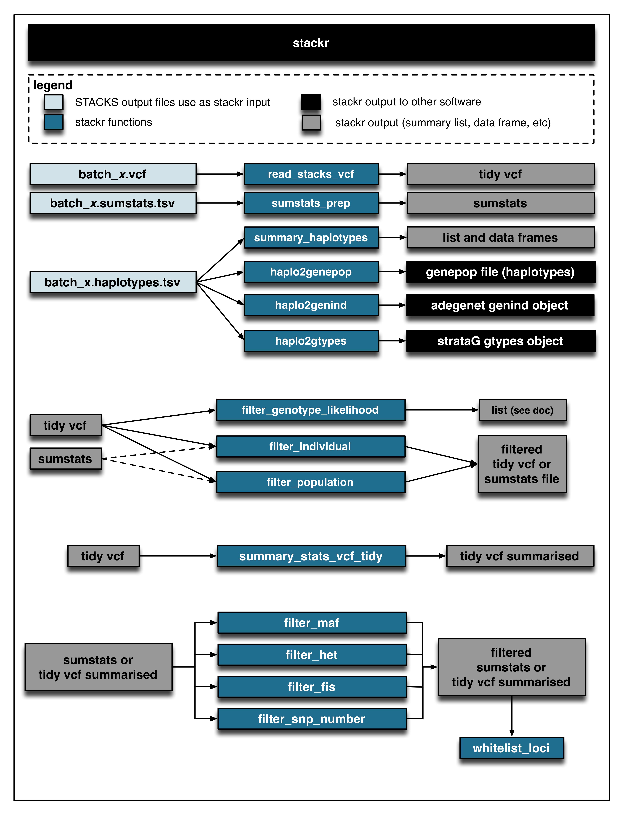

# stackr

[](https://travis-ci.org/thierrygosselin/stackr) [](http://dx.doi.org/10.5281/zenodo.20563)


The goal of **stackr** is to make GBS/RAD data produced by [STACKS] (http://creskolab.uoregon.edu/stacks/) easy to analyse in R.

This is the development page of the **stackr** package for the R software.

* Optimized for *de novo* and population genetics.
* Read and modify *batch_x.sumstats.tsv* and *batch_x.haplotypes.tsv* files.
* Transform the VCF file, *batch_x.vcf*, into a tidy format to visualise and filter summary statistics within R.
* Filters genetic markers based on: coverage (read depth, REF and ALT allele depth), genotype likelihood, the number of individuals, the number of populations, minor allele frequency (local and global), observed heterozygosity and inbreeding coefficient (Fis).
* View distribution of summary statistics and create publication-ready figures.
* Convert data into *genepop*, *genind* and *gtypes* object for easy integration with [adegenet] (https://github.com/thibautjombart/adegenet), [strataG] (https://github.com/EricArcher/strataG.devel/tree/master/strataG.devel), [hierfstat] (https://github.com/jgx65/hierfstat), [pegas] (https://github.com/emmanuelparadis/pegas) and [poppr] (https://github.com/grunwaldlab/poppr).
* Map-independent imputation of GBS markers using Random Forest is now integrated within the *haplo2genepop*, *haplo2genind*, *haplo2gtypes* and *haplo2colony* functions. 

## New
**The *summary_haplotypes* function now output:**
* Putative paralogs, consensus, monomorphic and polymorphic loci.
* The haplotypes statistics for the observed and expected homozygosity and 
heterozygosity.
* Wright’s inbreeding coefficient (Fis).
* A new proxy measure of the realized proportion of the genome that is identical
by descent (IBDG), the FH measure is based on the excess in the observed number
of homozygous genotypes within an individual relative to the mean number of 
homozygous genotypes expected under random mating (Keller et al., 2011; 
Kardos et al., 2015).
* The nucleotide diversity (Pi) is also given. 
Pi measured in the package consider the consensus loci in the catalog 
( = the reads with no variation between population). It's Nei & Li (1979) 
function, adapted to the GBS reality.

Keller MC, Visscher PM, Goddard ME. 2011. Quantification of inbreeding due to 
distant ancestors and its detection using dense single nucleotide polymorphism
data. Genetics, 189, 237–249.

Kardos M, Luikart G, Allendorf FW. 2015. Measuring individual inbreeding in the 
age of genomics: marker-based measures are better than pedigrees. 
Heredity, 115, 63–72.

Nei M, Li WH. 1979. Mathematical model for studying genetic variation in terms
of restriction endonucleases. Proceedings of the National Academy of Sciences 
of the United States of America, 76, 5269–5273.

**The *haplo2colony* function**
* This function can first filter the haplotypes file with a whitelist of loci 
and a blacklist of individuals.
* Converts the file to the required *COLONY* input file.
* Can imputed the data with Random Forest or the most frequent category.
* Using the *print.all.colony.opt* will output all COLONY options to the file.
This however requires manual curation of the file to work directly with COLONY. 

## Roadmap of what's up next

* Very soon: Joint Allele Frequency Spectrum from a *batch_x.sumstats.tsv* or a *batch_x.haplotypes.tsv* files.
* Re-Integration with [strataG] (https://github.com/EricArcher/strataG.devel/tree/master/strataG.devel).
* Documentation and vignette.
* Tutorial of workflow.
* More linkage map tools.
* Use Shiny and ggvis when subplots or facet available.
* CRAN.
* Interaction with [STACKS] (http://creskolab.uoregon.edu/stacks/) database (Web-interface).
* Reference genome tools.
* Maybe try some integration with other GBS approaches: AftrRAD, pyRAD, dDocent.
* Got ideas ?


## Installation
You can try out the dev version of **stackr**. Follow the 2 steps below.

Step 1 You will need the package *devtools* and the dev version of *readr*
```r
install.packages("devtools")
library(devtools)
install_github("hadley/readr")
library(readr)
```

Step 2 Install **stackr**:
```r
install_github("thierrygosselin/stackr")
library(stackr)
```

On Mac OSX using a version of clang (the native compiler) with OpenMP greatly reduce the computation time for the imputation. There is a GCC version with OpenMP but it's highly unstable in R. To update your computer's compiler, follow the instruction below (inspired from [here](https://clang-omp.github.io)). In the terminal:

```r
cd Downloads
git clone https://github.com/clang-omp/llvm
git clone https://github.com/clang-omp/compiler-rt llvm/projects/compiler-rt
git clone -b clang-omp https://github.com/clang-omp/clang llvm/tools/clang

cd llvm
./configure
make
sudo make install
```

You need to tell R which compilers to use. Use TextWrangler or follow the lines below:
```r
cd ~
nano .R/Makevars
```

Enter the text below:
```r
CC=clang
CXX=clang++
PKG_CFLAGS=-g -O2
PKG_CXXFLAGS=-g -O2 -stdlib=libc++
```
Save and Exit with: crt-o, enter, crt-x


Preferably, re-install all packages depending on OpenMP or Rcpp.

```r
install.packages("Rcpp", type = "source")
install.packages("dplyr", type = "source")
install.packages("randomForestSRC", type = "source")
```
## Example 

**Using *haplo2genind* function to do a DAPC analysis of your data (5 steps).**

Step 1. Load the necessary librairies, here is an example of how to do this:
```r
library(adegenet)
library(stackr)
```
Step 2. Set your working directories (e.g. the path to your stacks output files and 
where you want the output to be saved)

```r
setwd("/Users/thierry/Dropbox/brook_charr_pop/01_stacks_populations")
```
Step 3. Missing genotypes: Remove individuals with more that 30% of missing genotypes 
from *batch_1.haplotypes.tsv* file. Explore this parameter with different values. 
I also feed the function a whitelist of loci that I want to keep (after filtering).
We are interested in the the blacklisted id output ("blacklisted.id.30.txt"),
but the function output also many things, see the function documentation.
```r
blacklisted.id <- missing_genotypes(haplotypes.file = "batch_1.haplotypes.tsv", 
whitelist.loci = "new.whitelist.txt", pop.id.start = 5, pop.id.end = 7, 
missing.geno.threshold = 30)
```

Step 4. I use the *haplo2genind* function to convert the haplotype file created by 
**stacks** into a genind object ready to use in **adegenet**. 
I use the whitelist of loci created after filtering the data and the blacklisted
individuals with more than 30% missing genpotypes created above. I also ask for 
imputation of the data using Random Forest.

```r
genind.sturgeon <- haplo2genind(haplotypes.file = "batch_1.haplotypes.tsv", whitelist.loci = "my.whitelist.txt", blacklist.id = "blacklisted.id.30.txt", pop.levels = c("LSL", "DRM", "JEN", "LAN", "GRA", "BUR", "GUL", "LLI", "ANG", "WEI", "FOX", "HAY", "GOD", "CHU"), pop.id.start = 5, pop.id.end = 7, imputations = "rf", imputations.group = "populations", num.tree = 100, split.number = 100, iteration.rf = 10, verbose = FALSE)
```

You can see that the object created is not yet a genind object because it contains 2 things: the imputed data and the data without imputation. To access both genind dataset:
```r
names(genind.sturgeon)
genind.sturgeon.noimputation <- genind.sturgeon$no.imputation
genind.sturgeon.imputed <- genind.sturgeon$imputed
```

Step 5. These 2 genind objects can be use directly in **adegenet**:
```r
dapc.optim.a.score <- optim.a.score(dapc(genind.sturgeon.imputed, n.da = 100, n.pca = 50))
dapc.optim.a.score$best
```

## GBS workflow
The **stackr** package fits currently at the end of the GBS workflow. Below, a flow chart using [STACKS] (http://creskolab.uoregon.edu/stacks/) and other software. You can use the [STACKS] (http://creskolab.uoregon.edu/stacks/) workflow [used in the Bernatchez lab] (https://github.com/enormandeau/stacks_workflow). 

Functions found in **stackr** 
An example of the workflow 
All-in-one filter 
Vignettes is a work in progress, check now and then for updates.
