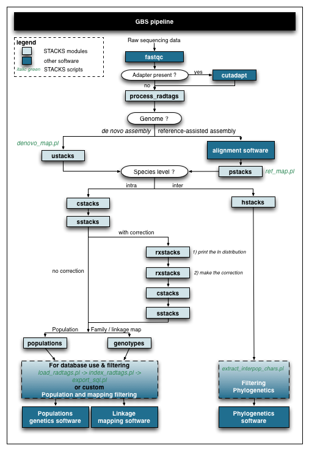

# stackr: an R package for the analysis of GBS/RADseq data

[](https://travis-ci.org/thierrygosselin/stackr)
[](https://ci.appveyor.com/project/thierrygosselin/stackr)
[](http://cran.r-project.org/package=stackr)
[](https://zenodo.org/badge/latestdoi/14548/thierrygosselin/stackr)
[](commits/master)
[)`-brightgreen.svg)](commits/master)


This is the development page of the **stackr**, 
if you want to help, see [contributions section](https://github.com/thierrygosselin/stackr#contributions)

## Use stackr to: import, explore, manipulate, filter, impute, visualize and export your GBS/RADseq data

* **Import/Export** your GBS/RADseq data with the various supported genomic file formats: *tidy*, *wide*, *VCF*, *PLINK* , *genepop*, *genind*, *genlight*, *hierfstat*, *gtypes*, *betadiv*, *dadi* and the haplotype file produced by [STACKS](http://catchenlab.life.illinois.edu/stacks/). 
Easy integration with other software or R packages like [adegenet] (https://github.com/thibautjombart/adegenet), [strataG] (https://github.com/EricArcher/strataG), [hierfstat] (https://github.com/jgx65/hierfstat), [pegas] (https://github.com/emmanuelparadis/pegas), [poppr] (https://github.com/grunwaldlab/poppr) and [assigner](https://github.com/thierrygosselin/assigner). 
Conversion functions are integrated with important filters, blacklist and whitelist.

* **Explore** and **filter** important variables caracteristics and statistics:
    * missing data,
    * read depth (coverage) of alleles and genotypes, 
    * genotype likelihood,
    * genotyped individuals and populations,
    * minor allele frequency (local and global MAF),
    * observed heterozygosity (Het obs) and inbreeding coefficient (Fis),
    * find duplicate individual and mixed samples.

* **Filter**: Most genomic analysis look for patterns and trends with various statistics. 
Bias, noise and outliers can have bounded influence on estimators and interfere with polymorphism discovery. 
Avoid bad data exploration and control the impact of filters on your downstream genetic analysis.
Alleles, genotypes, markers, individuals and populations can be filtered and/or selected in several ways.

* **Map-independent imputation** of missing genotype/alleles 
using Random Forest or the most frequent category.

* **Visualization:** `ggplot2`-based plotting for publication-ready figures.

 
## Installation
To try out the dev version of **stackr**, copy/paste the code below:

```r
if (!require("devtools")) install.packages("devtools") # to install
library(devtools) # to load
devtools::install_github("thierrygosselin/stackr", build_vignettes = TRUE)  # to install WITH vignettes
library(stackr) # to load
```

## Prerequisite - Suggestions - Troubleshooting
  * **Parallel computing**: Follow the steps in this [vignette](https://github.com/thierrygosselin/stackr/blob/master/vignettes/vignette_imputations_parallel.Rmd) 
  to install an OpenMP enabled [randomForestSRC](http://www.ccs.miami.edu/~hishwaran/rfsrc.html)
 package to do imputations in parallel.
  * **Installation problem:** see this
  [vignette](https://github.com/thierrygosselin/stackr/blob/master/vignettes/vignette_installation_problems.Rmd)
  * **Windows users**:  1. Install [Rtools](https://cran.r-project.org/bin/windows/Rtools/). 2. To have *stackr* run in parallel, use [parallelsugar](https://github.com/nathanvan/parallelsugar).
  Easy to install and use ([instructions](https://github.com/nathanvan/parallelsugar#installation)).
  * For a better experience in **stackr** and in R in general, I recommend using [RStudio](https://www.rstudio.com/products/rstudio/download/). 
  The R GUI is unstable with functions using parallel ([more info](https://stat.ethz.ch/R-manual/R-devel/library/parallel/html/mclapply.html)). 
  Below, the combination of packages and how I install/load them :
  
  ```r
  if (!require("pacman")) install.packages("pacman")
  library("pacman")
  pacman::p_load(devtools, reshape2, ggplot2, stringr, stringi, plyr, dplyr, tidyr, readr, purrr, data.table, ape, adegenet, parallel, lazyeval, randomForestSRC, hierfstat, strataG)
  pacman::p_load(devtools, reshape2, ggplot2, stringr, stringi, plyr, dplyr, tidyr, readr, purrr, data.table, ape, adegenet, parallel, lazyeval, randomForestSRC, hierfstat, strataG)
  # install_github("thierrygosselin/stackr", build_vignettes = TRUE) # uncomment to install
  library("stackr")
  ```

## Vignettes and examples

From a browser:
* [installation problems](https://github.com/thierrygosselin/stackr/blob/master/vignettes/vignette_installation_problems.Rmd)
* [parallel computing during imputations](https://github.com/thierrygosselin/stackr/blob/master/vignettes/vignette_imputations_parallel.Rmd) 
* [vcf2dadi](https://github.com/thierrygosselin/stackr/blob/master/vignettes/vignette_vcf2dadi.Rmd)
* [haplo2genind](https://github.com/thierrygosselin/stackr/blob/master/vignettes/vignette_haplo2genind.Rmd)
* [Missing data visualization and analysis](https://github.com/thierrygosselin/stackr/blob/master/vignettes/vignette_missing_data_analysis.Rmd)
Inside R:
```r
browseVignettes("stackr") # To browse vignettes
vignette("vignette_vcf2dadi") # To open specific vignette
```

Vignettes are in development, check periodically for updates.


## Citation:
To get the citation, inside R:
```r
citation("stackr")
```

## New features
Change log, version, new features and bug history now lives in the [NEWS.md file] (https://github.com/thierrygosselin/stackr/blob/master/NEWS.md)

**v.0.4.3**
* bug fix in `summary_haplotypes` stemming from a new `readr` version
* `artifacts` replace `paralogs` in `summary_haplotypes`


**v.0.4.2**
* `gtypes` object from [strataG] (https://github.com/EricArcher/strataG) package
can now be read/write in/out of **Stackr** using the `tidy_genomic_data` and 
`genomic_converter` functions.

For previous news:
[NEWS.md file] (https://github.com/thierrygosselin/stackr/blob/master/NEWS.md)

## Roadmap of future developments:

* Until publication **stackr** will change rapidly (see contributions below for bug reports).
* Updated filters: more efficient, interactive and visualization included: *in progress*
* Better integration with other GBS/RADseq approaches, beside [STACKS](http://catchenlab.life.illinois.edu/stacks/): *in progress* 
* Integrated converter function to input and output several file formats: *done*
* Workflow tutorial that links functions and points to specific vignettes to further explore some problems: *in progress*
* Integration of several functions with [STACKS](http://catchenlab.life.illinois.edu/stacks/) and [DArT](http://www.diversityarrays.com) database.
* Use Shiny and ggvis when subplots or facets becomes available...
* Suggestions ?


## Contributions:

This package has been developed in the open, and it wouldn’t be nearly as good without your contributions. There are a number of ways you can help me make this package even better:  
* If you don’t understand something, please let me know. 
* Your feedback on what is confusing or hard to understand is valuable. 
* If you spot a typo, feel free to edit the underlying page and send a pull request.

New to pull request on github ? The process is very easy:  
* Click the edit this page on the sidebar.
* Make the changes using github’s in-page editor and save.
* Submit a pull request and include a brief description of your changes. 
* “Fixing typos” is perfectly adequate.


## GBS workflow
The **stackr** package fits currently at the end of the GBS workflow. Below, a flow chart using [STACKS] (http://catchenlab.life.illinois.edu/stacks/) and other software. You can use the [STACKS] (http://catchenlab.life.illinois.edu/stacks/) workflow [used in the Bernatchez lab] (https://github.com/enormandeau/stacks_workflow). 

## stackr workflow 
Currently under construction. Come back soon!

**Table 1: Quality control and filtering RAD/GBS data**

| Parameters | Libraries & Seq.Lanes | Alleles | Genotypes | Individuals | Markers | Sampling sites | Populations | Globally |
|:----|:----:|:----:|:----:|:----:|:----:|:----:|:----:|:----:|
| Quality |x| | |x| | | | |
| Assembly and genotyping |x| | | | | | | |
| Outliers | |x|x|x|x| | | |
| Missingness |x|x|x|x|x|x|x|x|
| Coverage | |x|x| |x| | | |
| Genotype Likelihood | | |x| | | | | |
| Prop. Genotyped | | | |x|x|x|x|x|
| HET & FIS & HWE | | | |x|x| |x| |
| MAF | | | | |x|x|x|x|
| Missingness |x|x|x|x|x|x|x|x|


**Step 1 Quality** Ask yourself these questions: 
* DNA quality, libraries quality, sequencing lanes quality ? 
* Please stop thinking in terms of quantity (e.g. millions of reads returned), and start thinking about actual quality of your new data.
* Use quality metrics inside available software (e.g. fastqc)

**Step 2 *de novo* assembly and genotyping** 
* This is conducted outside stackr
* Integrated software pipelines include: [STACKS](http://catchenlab.life.illinois.edu/stacks/), [pyRAD](http://dereneaton.com/software/), [dDocent](https://ddocent.wordpress.com), [AftrRAD](http://u.osu.edu/sovic.1/downloads/). If you want to develop your own pipeline, 
there are a multitude of approaches, good luck. 

**Step 3 Outliers**
* Remove replicates (I hope you have some).
* Remove *de novo* assembly artifact, by creating blacklist of genotypes or whitelist of markers:
    * individuals with more than 2 alleles (use `summary_haplotypes`)
    * outlier markers with extreme number of SNP/read or haplotype (use `filter_snp_number`)
* Remove potential duplicated samples that went off your radar, try `find_duplicate_genome`.
* Highlight outliers individual's heterozygosity that might represent mixed samples with `filter_individual_het`.
* The metric you're using: a *de novo* artefact or a reliable signal of biological polymorphism?
* Should the statistic you are interested in be consistent throughout the read ?
* Will you consider haplotype or snp level statistics?
* The consistensies of SNPs statistics among haplotype can be throughly tested by using `snp.ld` argument in several stackr functions.
* Any other outliers with different individual's or markers metrics (reads/sample, etc) ?

**Step 4 Pattern of missingness**
* Use `missing_visualization` with/without your new blacklists (e.g. of genotypes, individuals) and with/without whitelist of markers to examine patterns of missingness in you dataset before more extensive filtering (there is a vignette for this step)
* The trick here is to use the `strata` argument to find patterns associated with different variables of your study (lanes, chips, sequencers, populations, sample sites, reads/samples, etc).
* Do you see a trend between your missing pattern and reads/samples ? Heterozygosity?
* Do you need more sequencing? Do you have to re-run some lanes? 

**Step 5-6 Coverage and Genotype Likelihood**
* Coverage is an individual metric. With most software you'll find allele and genotype coverage info.
* Genotype likelihood is usually a metric based on coverage of the different genotypes found in all of your data.
* Good allele coverage is required for reliable genotypes.
* Reliable genotypes is required for reliable downstream summary statistics.
* Explore filtering options in `filter_coverage` and `filter_genotype_likelihood`.

**Step 7 Prop. Genotyped**
* Do you have enough individuals in each sampling sites (`filter_individual`) 
and enough putative populations (`filter_population`) for each markers ?
* Use blacklist of individuals with different thresholds.
* Keep different whitelist of markers.
* Use `common.markers` argument inside most of stackr functions to test the impact of vetting loci based on shared markers.
* Use imputation methods provided by stackr (inside `tidy_genomic_data` or `genomic_converter`, as a separate module: `stackr_imputations_module`) to assess the impact of lowering or increasing threshold that impact missing data.

**Step 8 HET, Fis, HWE**
* Overall and/or per populations hwe, heterozygosity and Fis statistics can highlight: 
*de novo* assembly problems (oversplitting/undermerging), genotyping problems or
biological problems.
* These filters allows to test rapidly if departure from realistic expectations
are a problem for downstream analysis ?
* Choose your threshold wisely and test impact on pipeline.
* Use `filter_het`, `filter_fis`, `filter_hwe` and look again 
at the individual's heterozygosity (`filter_individual_het`) for outliers.

**Step 9 MAF**
* Remove artifactual and uninformative markers.
* Use MAF arguments inside several of stackr functions to tailor MAF to your analysis tolerance to minor allelel frequencies.
* There is also a separate filter in stackr: `filter_maf`

**Step 10 Pattern of missingness, again**
* Use `missing_visualization` with your new blacklists (e.g. of genotypes, individuals) and with your whitelist of markers to examine patterns of missingness in your dataset after filtering (there is a vignette for this step)
* The trick here is to use the `strata` argument to find patterns associated with different variables of your study (lanes, chips, sequencers, populations, sample sites, reads/samples, etc).
* Do you see a trend between your missing pattern and reads/samples ? Heterozygosity?


